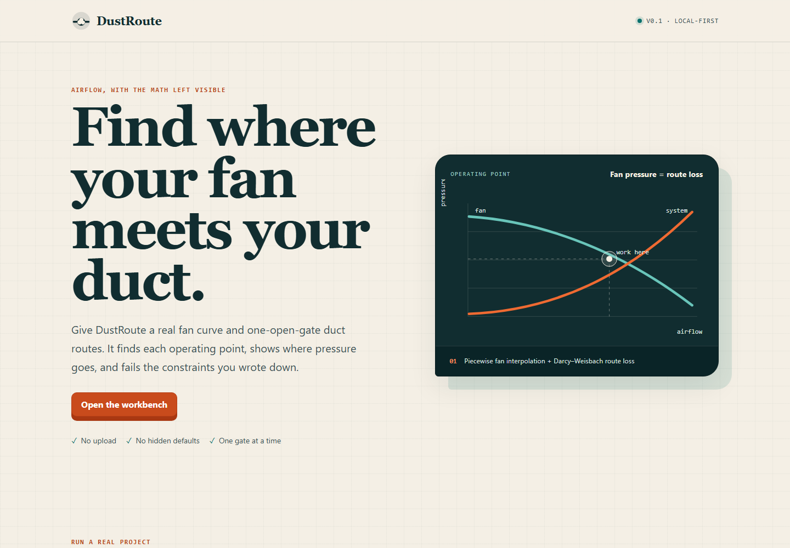

# DustRoute

[English](README.md) · [在线工作台](https://kanadek.github.io/dustroute/) · [示例项目](examples/garage-shop.json) · [公式说明](docs/equations.md)

[](https://github.com/KanadeK/dustroute/actions/workflows/ci.yml)
[](https://github.com/KanadeK/dustroute/actions/workflows/pages.yml)
[](LICENSE)

**面向“每次只开一个闸门”的木工集尘系统：把真实风机曲线与管路损失曲线透明地求交。**

你提供集尘器风机曲线、明确的管段，以及每台工具的约束；DustRoute 计算每条路线的工作点、逐段压力损失、输送风速和通过/失败余量。CLI 与免登录浏览器工作台使用完全相同的计算核心，数据留在本机。



## 为什么做这个项目

只给一个 CFM 数字的计算器隐藏了真正的关系：集尘器按照风机曲线提供压力，管路则随着风量消耗压力；工作点是两条曲线的交点。画出管线路径也不等于证明系统能在目标处工作。

DustRoute 把这条证据链保留下来：

- 对你提供的风机曲线做分段线性插值；
- 用 Darcy–Weisbach 沿程损失与显式配件 K 值计算每个管段；
- 用确定性的二分法求风机/系统曲线交点；
- 将工作风量和每个管段的风速与**你写下的**约束比较；
- 终端、JSON、Markdown 和浏览器结果全部来自同一个核心。

它**不会**偷偷补一个风机曲线、通用安全阈值、配件余量或设备推荐。

## 快速开始

需要 Node.js 22 或 24。

```bash
git clone https://github.com/KanadeK/dustroute.git
cd dustroute
npm ci
npm run check
```

预期结果：

```text
PASS 3/3 routes

PASS Table saw  619.1 CFM @ 9.55 in. wg
PASS Planer     629.0 CFM @ 9.50 in. wg
PASS Miter saw  428.1 CFM @ 10.55 in. wg
```

启动本地浏览器工作台：

```bash
npm start
```

打开 `http://127.0.0.1:4173`。静态应用没有后端、账号、遥测或第三方脚本。

## CLI

```bash
# 适合阅读的终端报告
node bin/dustroute.js analyze examples/garage-shop.json

# 机器可读结果
node bin/dustroute.js analyze examples/garage-shop.json --format json

# Markdown 报告
node bin/dustroute.js analyze examples/garage-shop.json --format markdown

# CI 门禁：任一路线没有达到已声明约束时退出 1
node bin/dustroute.js check examples/garage-shop.json
```

退出码是稳定接口：

| 退出码 | 含义 |
| ---: | --- |
| `0` | 分析完成；对 `check` 来说，所有路线通过 |
| `1` | `check` 完成，但至少一条路线未达到已声明约束 |
| `2` | 命令用法、文件、JSON 或项目校验错误 |

所有输入字段与输出模式见[使用与项目格式](docs/usage.md)。

## 浏览器工作台

在线/本地静态应用可以：

- 载入自带的三工具通过示例；
- 导入或粘贴不超过 1 MiB 的项目 JSON；
- 用鼠标或方向键切换路线；
- 绘制风机曲线与该路线的系统曲线；
- 展示每段风速、压力损失和有效 K；
- 下载完整分析 JSON 或 Markdown 报告；
- 页面完成加载后，即使断网也能继续计算。

导入的标签会经过校验，并只以文本节点渲染。浏览器数据不会发送到服务器。

## 使用自己的项目

复制 [examples/garage-shop.json](examples/garage-shop.json)，然后用厂家资料、测量结果或你明确选定的数值替换**每一个物理输入**：

```json
{
  "schemaVersion": 1,
  "project": { "name": "我的工坊" },
  "air": {
    "densityKgM3": 1.204,
    "kinematicViscosityM2S": 0.00001506
  },
  "fanCurve": [
    { "cfm": 0, "pressureInWg": 8.2 },
    { "cfm": 900, "pressureInWg": 4.1 },
    { "cfm": 1400, "pressureInWg": 0 }
  ],
  "segments": [
    {
      "id": "main",
      "label": "主管",
      "lengthFt": 20,
      "diameterIn": 5,
      "roughnessIn": 0.0006,
      "lossMultiplier": 1,
      "fittings": [
        { "label": "长半径弯头", "lossCoefficient": 0.2, "quantity": 2 }
      ]
    }
  ],
  "routes": [
    {
      "id": "planer",
      "label": "压刨",
      "targetCfm": 500,
      "minTransportFpm": 3500,
      "segmentIds": ["main"]
    }
  ]
}
```

仓库示例只用于证明流程，不是设计建议。

## 可复制验收命令

在干净检出中运行完整本地发布门禁：

```bash
npm ci
npm test
npm run test:coverage
npm run lint
npm run build
npm run check
npm audit --audit-level=high
npm pack --dry-run
```

再单独验证真实失败路径。下面的命令应同时指出两个失败约束，并以 `1` 退出：

```bash
node bin/dustroute.js check examples/undersized-route.json
```

## 命令失败时怎么修

根据退出码和第一条具体错误处理，不要为了让徽章变绿而随意改数值。

1. **退出 `2`，显示字段路径**：修复该 JSON 字段。风机点必须从 `0 CFM` 开始，CFM 严格递增，压力不能回升，并以 `0 in. wg` 结束；管段/路线 ID 必须唯一，引用的管段必须存在。
2. **退出 `2`，计算错误**：某个有限 JSON 数字在单位转换或计算后发生了上溢/下溢。检查报告点名管段是否填了不可能的数量级或错误单位；DustRoute 会拒绝把 `NaN`/无穷值伪装成结果。
3. **退出 `1`，风量不足**：先看该路线压力损失最大的管段，再核实真实风机曲线、长度、直径、粗糙度、配件 K 和损失倍数。只修改与真实系统不符的输入。
4. **退出 `1`，风速不足**：检查报告点名的管段，复核其直径和你明确选择的最小风速。DustRoute 不会替你换一个更容易通过的阈值。
5. **构建或测试失败**：先运行 `node --version`（要求 22/24）；若 `dist/` 陈旧，只删除这个生成目录；执行 `npm ci`，先重跑单个失败命令，再跑完整门禁。
6. **结果仍明显不合理**：停止把该结果作为决策依据。重新检查单位和数据来源，对照设备文档或测量值；后果较大时取得合格专业复核。

更多情况见[故障排查](docs/troubleshooting.md)。

## 公式与声明边界

DustRoute 把公开的英制输入转换为 SI，计算雷诺数与 Darcy 摩阻系数，合并沿程损失和显式局部损失，再求曲线交点。完整公式、常数、过渡规则、数值锚点与主要技术来源见 [docs/equations.md](docs/equations.md)。

结果是基于用户输入的规划估算，不是 CFD、颗粒捕集模拟、多闸门同时平衡、法规符合性、认证或专业验收。局部排风指南与设备说明仍然优先。

## 架构

```text
项目 JSON ──> 校验 ──> 共享计算核心 ──> 分析对象
                                  ├─ 终端
                                  ├─ JSON
                                  ├─ Markdown
                                  └─ 浏览器 / SVG
```

项目没有运行时或开发依赖。CLI 与浏览器直接导入 `src/core/` 下的同一组 ECMAScript 模块；静态构建把它们原样复制到 `dist/core/`。设计理由见 [ADR-0001](docs/decisions/0001-zero-dependency-static-architecture.md)。

## 范围

v0.1 刻意只支持一次打开一个闸门。它不求解多支路同时流动，不模拟捕集效率或颗粒，不自动设计平面布置，不推荐设备，也不把项目保存到云端。这些是需要不同证据的不同产品。

## 贡献与安全

贡献前请读 [CONTRIBUTING.md](CONTRIBUTING.md)。安全漏洞请按 [SECURITY.md](SECURITY.md) 私下报告，不要开公开 Issue。

MIT © KanadeK。见 [LICENSE](LICENSE)。
